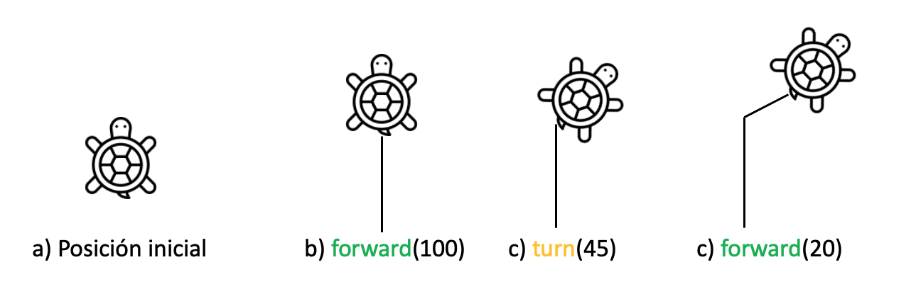
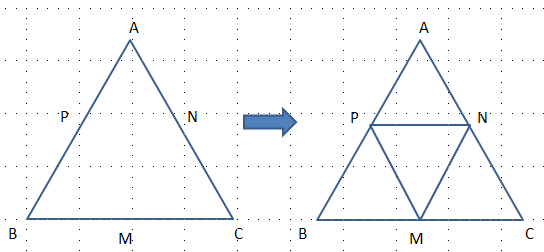
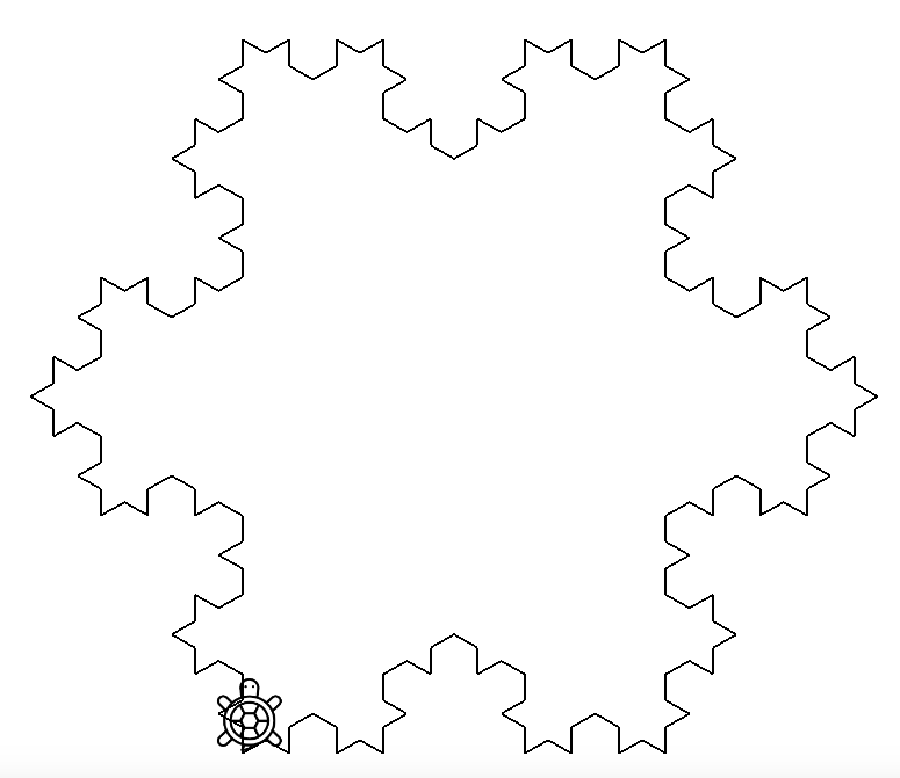
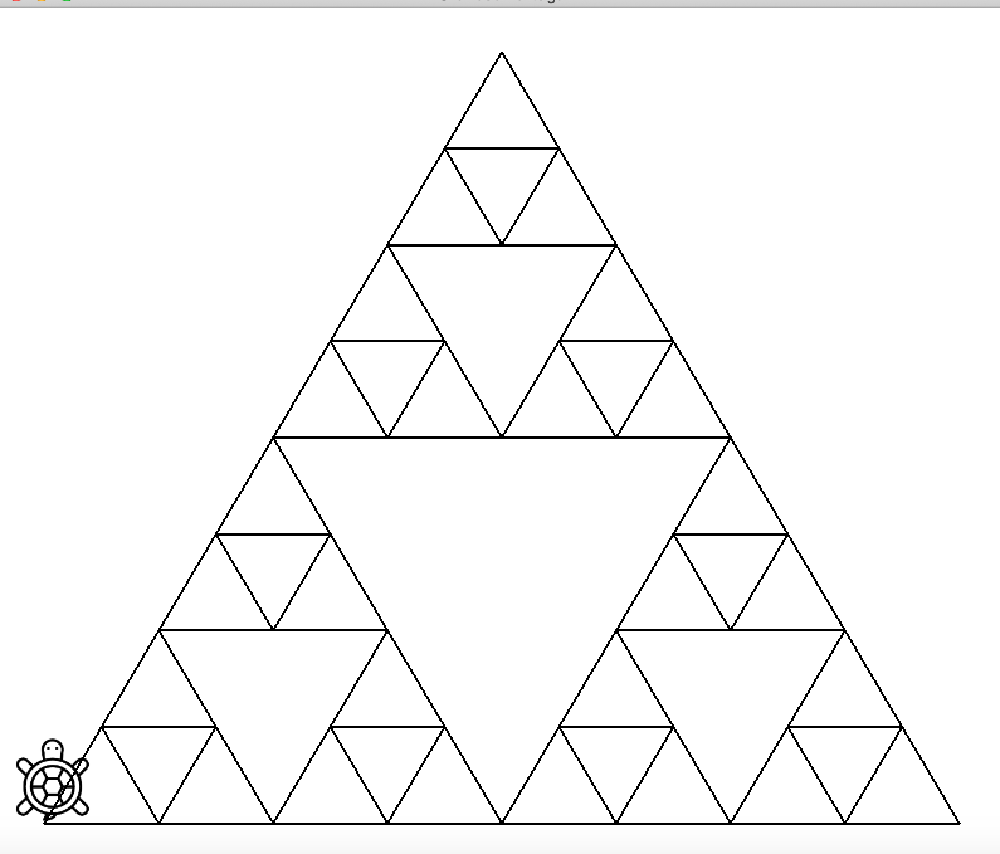

<p align="center">
 
</p>

## Gráficos Tortuga

Donatelo es una tortuga muy feliz que vive en un mundo bidimensional pintado de blanco, por el cual puede desplazarse libremente. Pero no solo eso, Donatelo es un excelente artista, que puede usar su propio mundo como lienzo y pintarlo usando su cola como pincel. En esta ocasión, Donatelo ha comprado un nuevo conjunto de colores y quiere compartir contigo este gran momento para que juntos puedan crear grandes obras de arte.

Como Donatelo no puede hablar nuestro idioma, la única manera en que te puedes comunicar con él es a través de la siguiente interfaz de operaciones:

```java
/*
* Donatelo se mueve hacia el frente las unidades determinadas por la variable distance.
*/
public void forward(double distance);

/*
* Donatello gira hacia su derecha la cantidad de grados indicados.
*/
public void turn(double angle);

/*
* Donatello sube su cola, por lo que cuando se desplaza no pintará nada. 
*/
public void penUp();

/*
* Donatelo baja su cola, asī que cuando se desplaza dejará pintado su rastro.
*/
public void penDown();

/*
* Donatello pone en su cola el color especificado.
*/
public void setTailColor(Color color);
```

El estado inicial en donde comienza Donatelo es mirando hacia el Norte con la cola levantada y el color en su cola establecido en Negro. Ver la siguiente imagen para mayor referencia:
<p align="center">

</p>

## Comandos
Puedes usar las siguientes teclas para controlar la escena:
1. Tecla Up   (^): Sube 
2. Tecla Down (v): Baja
3. Tecla Left (->): Mueve hacia la izquierda
4. Tecla Up   (<-): Mueve hacia la derecha
5. Tecla I: Zoom In
6. Tecla O: Zoom Out

## Objetivo
Ayuda a Donatelo a crear diversos Fractales usando para ello recursión.

## Contexto
Un fractal, cuyo vocablo proviene del latín _fractus_ que significa quebrado, es una estructura cuya característica principal es su identidad de ser construida por la repetición o iteración de un patrón. Por ello, los fractales son buenos candidatos para usar recursión.

a) El triángulo de Sierpinski es un fractal que se puede contruir a partir de un triángulo equilátero; esa sería la figura para el primer nivel. Para incrementar su profundidad tomamos el triángulo original, con vértices (A, B, C). Posteriormente, se calculan los puntos intermedios entre los 3 lados, supongamos P, N y M, y se manda a llamar recursivamente la construcción del triángulo de Sierpinski con los puntos (B, M, P), (M, N, C) y (A, P, N). Ver la siguiente figura:
<p align="center">

</p>

b) El copo de nieve o Fractal koch, es una estrucutura que inicia con un segmento de longitud L; esa sería la figura para el primer nivel. Para incrementar su profundidad tomamos el segmento y lo dividimos en 3, en el cual, el segmento intermedio se reemplaza por un triángulo equilatero de longitud L/3. Finalmente, se manda a llamar recursivamente la construcción del copo de nieve para cada uno de los 4 lados.
Para construir el copo de nievel completo solo basta repetir el patrón anterior 3 veces girando entre cada uno de ellos 120 grados.

## Ejercicios

1. Crea una función llamada **snowflake_side** que recibe la longitud inicial y el nivel de recursión requerido. Dicho función dibujará uno de los lados del copo de nieve.
2. Crea una función, llamada **snowflake** que recibe la longitud y nivel de recursión requerido. Esta función invocará 3 veces a __snowflake_side__ girando a Donatelo 120 grados entre cada uno de ellas.
3. En el método **draw** invoca a la función __snowflake__ con L = 90 y nivel = 3. Tu resultado debe verse algo parecido a esto:
<p align="center">

</p>

4. Comenta la llamada a __snowflake__ en el método __draw__.
5. Ahora, suponiendo que Donatelo esta en su estado inicial (mirando hacia el Norte y con la cola subida), crea una función llamada **triangulo** que reciba una longitud, cree un triángulo equilátero y deje a Donatelo de nuevo en su estado inicial.
6. Crea una función llamada **sierpinski** cuya firma es la siguiente:
```java
/**
* @param inicio: Punto en donde esta Donatelo, suponiendolo en su estado inicial
* @param longitud: Longitud de cada lado del Tringulo Equilátero principal.
* @param depth: Nivel de recursion deseado.
**/
public void sierpinski(Point2D inicio, double longitud, int depth);
```
Dicha función debe llamarse de nuevo a si misma dibujando para ello los subtriángulos. Calcula las posiciones en donde tendría que empezar Donatelo para construirlos. Al final de la función recuerda regresar a Donatelo a la posición en donde comenzó (para eso es el argumento **Point2D inicio**). Recuerda que la altura de un tríangulo equilatero se puede calcular como **h = longitud*sqrt(3) / 2**
7. En el método **draw** invoca la función __sierpinski__ con inicio= (0,0), L = 100 y nivel=3.
8. La figura resultante debe de pareserse a esto:
<p align="center">

</p>


## Referencias
1. [Copo de nieve](https://es.wikipedia.org/wiki/Copo_de_nieve_de_Koch)
2. [Triángulo de Sierpinski](https://es.wikipedia.org/wiki/Tri%C3%A1ngulo_de_Sierpinski)

## Depedencias
1. [Java JDK](https://www.oracle.com/technetwork/es/java/javase/downloads/index.html) >= 1.8
2. [Apache Ant](https://ant.apache.org/bindownload.cgi) >= 1.10.9 
3. [LWJGL](http://legacy.lwjgl.org/) = 2.9.3

## Ejecutar tu Programa
1. Entrar en la carpeta del proyecto en la terminal usando el comando **cd**.
2. Usando un editar abre el archivo **build.xml** y ubica la siguiente línea:

```xml
<property name="os" value="macosx"/> 
```

3. Cambia el valor por el sistema operativo que estas utilizando, las posibles opciones son:

      windows | linux | macosx | solaris | openbsd | freebsd
      
4. Compilar el proyecto usando Ant:

        $ ant compile
        
3. Posteriormente puedes ejecutarlo invocando:

        $ java -Djava.library.path=./lib/lwjgl-2.9.3/native/macosx -jar TurtleGraphics.jar

## Problemas conocidos
1. En dado caso de que tu programa arroje el siguiente error:

        LWJGLException: Pixel format not accelerated

Significa que los drivers de la tarjeta gráfica estan desactualizados. Intenta actualizarlos desde la pagina del fabricante utilizando el modelo. Si te sigue sin funcionar puedes correr la tortuga con Applets. Lo cual será un poco más difícil de visualizar ya que:

- No se hará la animación.
- No se dibujará la tortuga
- La imagen resultante estará reflejada sobre el eje X.
- Es posible que haya errores de precisión y que tu imagen no quede tan algo torcida.

Pero al menos podrás visualizar lo que estas programando. Trata de no darle longitudes no tan pequeñas pero tampoco tan grande. Tu figura debe caben en un cuadrado de 800x800.

Para ejecutar la tortuga en este modo, prueba ejecutando:

            $ ant run_applet
